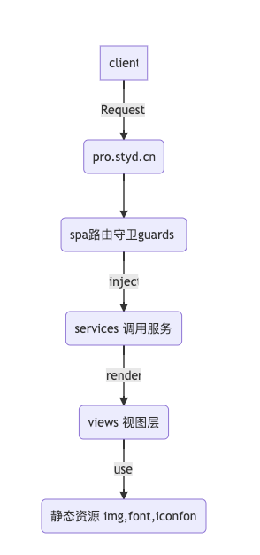

# saas-pro

## 初始化

请确保已全局安装 yarn

```
npm run init
```

### 本地开发

```shell
# linux macos windows 用户
# 使用dev环境的api
npm run dev

# 使用test环境的api
npm run dev:test

# 使用pre环境api
npm run dev:pre
```

## 开发mock账号
abc123
abc123

## 站点域名
* [dev开发环境](https://saas.dev.styd.cn)
* [test测试环境](https://saas.test.styd.cn)
* [pre预发布环境](https://saas.pre.styd.cn)
* [prod生产环境](https://pro.styd.cn)


## 前序准备

- nodejs 8.12.0 以上版本

## 知识储备
saas 项目使用了如下技术栈 如以前从未接触过的，可至以下网站进行了解

- [typescript 中文手册](https://www.tslang.net/basic-types.html)
- [rxjs v6 学习指南](http://www.cnblogs.com/ang-/p/9514430.html)
- [vue 官方网站](https://cn.vuejs.org/v2/guide/)
- [vue-router 官方网站](https://router.vuejs.org/zh/)
- [vue-service-app] 自定义的基于 vue-router 的依赖注入框架

## 应用数据流


## 目录结构
```shell
├── _modules #多页入口
├── api #后端api申明入口
├── assets #静态资源
│   ├── font
│   └── img
├── constants # 配置，常量枚举
├── directives # 自定义vue指令
├── filters # 自定义vue过滤器
├── guards # 路由守卫
├── i18n # 国际化(暂无用)
├── mixins # 自定义vue mixin
├── modal-router # vue-modal-router 入口
├── operators # 自定义rxjs 操作符
├── polyfills # 全局js polyfills
├── router # 路由入口
├── services # 全局服务
├── style # 全局样式
│   └── _components
├── types # 应用d.ts
├── utils # 工具函数
├── vendor # 自定义vue插件
└── views # 视图文件夹
    ├── biz-components # 业务组件
    ├── biz-modals # 带业务属性模态窗
    ├── components # 全局ui组件
    ├── fragments # 业务片段组件
    ├── layouts # 应用布局视图
    ├── modals # 全局的模态窗
    └── pages # 视图页面和路由url一一对应
        ├── brand # 品牌维度页面
        ├── extra # 公共维度页面
        ├── shop # 门店维度页面
        ├── styleguide # 项目styleguide
        └── test # 个人测试用页面文件夹
```


